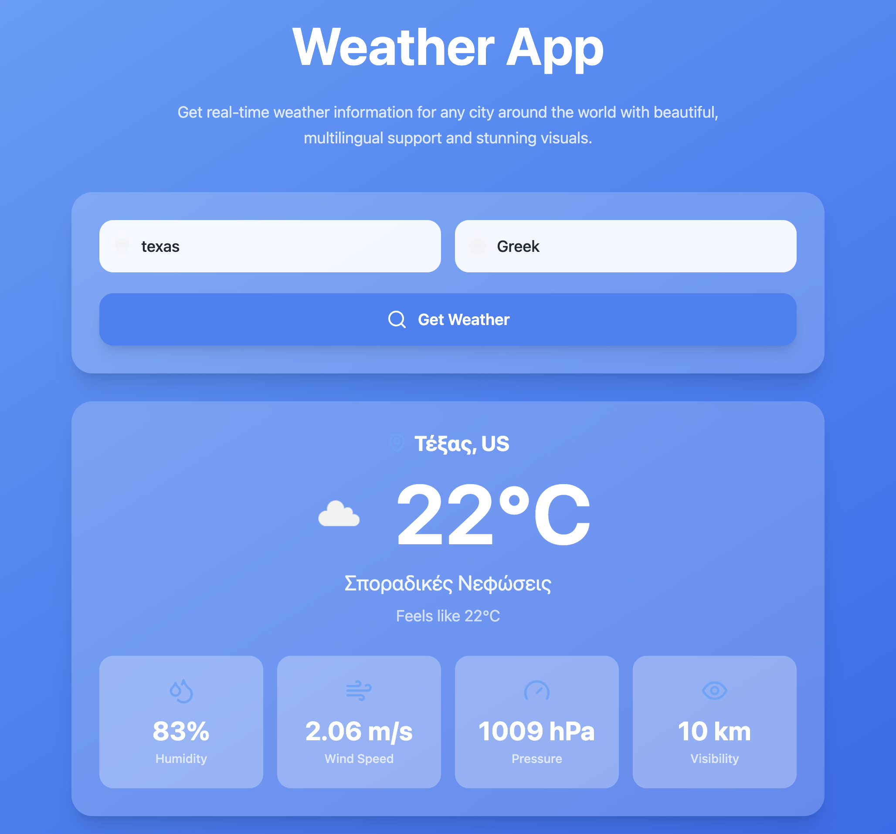

# 🌦️ Weather App (Web | API | Multilingual)

A visually stunning, multilingual weather web application that delivers real-time weather data for any city worldwide.  
Built with a modern UI and seamless user experience, this app leverages a weather API for accurate, live updates—now just a click away in your browser!

---

## 📌 Features

- 🌍 **City-based Weather Search** – Type any city and get instant weather details
- 🌐 **Multilingual Support** – View weather data in your chosen language
- ⚡ **Live API Integration** – Fetches up-to-date weather info from OpenWeatherMap
- 🧠 **Smart Error Handling** – Handles invalid city names, API errors, and edge cases
- 💻 **Beautiful Responsive UI** – Clean, modern design with smooth visuals (see screenshot below)
- 📱 **Cross-Platform** – Works on desktop and mobile browsers

---

## 🛠️ Tech Stack

- **Frontend**: Vite + React + TypeScript
- **Backend**: Node.js + Express
- **Tailwind CSS** (or your styling framework)
- **OpenWeatherMap API** (for weather data)
- **Multilingual Support** (via OpenWeatherMap API)

---

## 🚀 Live Demo

Will be live soon.....

---

## 🖼️ Screenshot


*Home page with weather search and output*

<p float="left">
  
  
  
  
</p>
---

## 🚀 How to Run

### 1. Clone the repository:
```bash
git clone https://github.com/Shreyan6514/Weather-App-Website.git
```

### 2. Navigate into the project folder:
```bash
cd Weather-App-Website
```

### 3. Install dependencies:
```bash
npm install
npm run server:install
```

### 4. Configure environment variables:

**Frontend (.env in root directory):**
```
# Frontend Configuration
VITE_API_BASE_URL=http://localhost:3001
```

**Backend (server/.env):**
```
# OpenWeatherMap API Configuration
OPENWEATHER_API_KEY=your_openweather_api_key_here

# Server Configuration
PORT=3001
```

### 5. Start both frontend and backend:
```bash
npm run dev:full
```

Or start them separately:
```bash
# Terminal 1 - Backend
npm run server:dev

# Terminal 2 - Frontend  
npm run dev
```

Open [http://localhost:5173/](http://localhost:5173/) in your browser.

---

## ⚙️ Configuration

- The app requires an **OpenWeatherMap API key** stored in `server/.env`.
- Frontend connects to backend via `VITE_API_BASE_URL` environment variable.
- You can get a free API key from [OpenWeatherMap](https://openweathermap.org/api).

---

## 🏗️ Architecture

- **Frontend**: React app running on port 5173 (Vite dev server)
- **Backend**: Express server running on port 3001
- **API Security**: OpenWeatherMap API key is stored securely on the backend
- **CORS**: Configured to allow frontend-backend communication

---

## 📝 Notes

- The backend server must be running for the weather functionality to work.
- API key is kept secure on the backend and never exposed to the frontend.
- The app supports all languages available in the OpenWeatherMap API.

---

## 💡 Inspiration

This project is the web version of [Weather App (Python)](https://github.com/Shreyan6514/Weather-App).  
It brings all the functionality of the CLI app to a beautiful, interactive website!

---

## 🤝 Contributing

Pull requests and suggestions are welcome. Please open an issue first to discuss major changes.

---

## 📄 License

MIT
